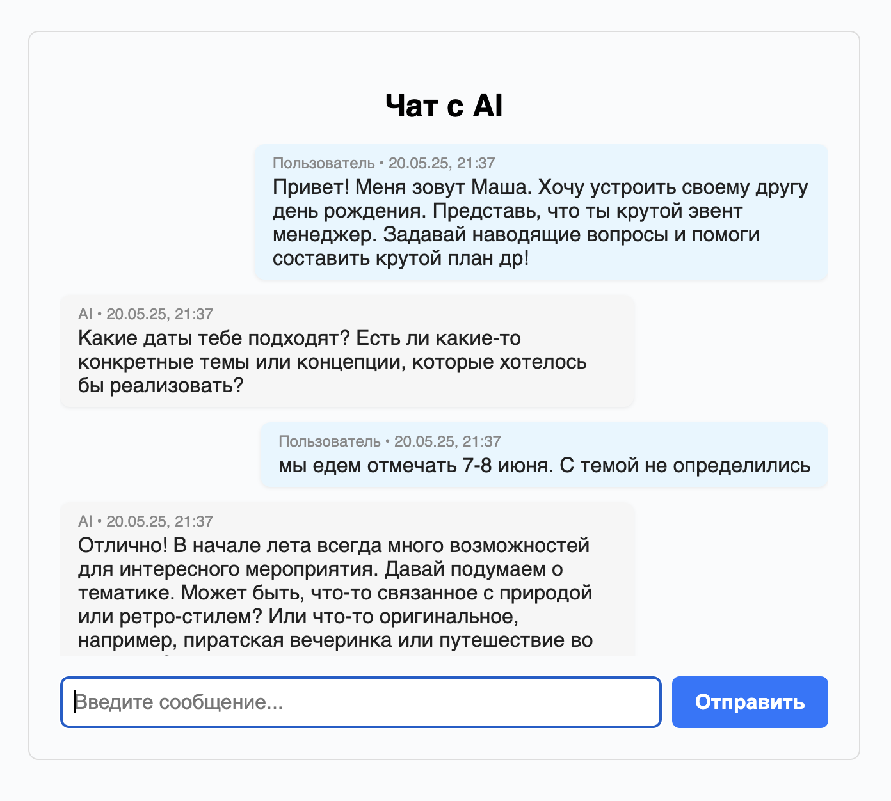

# ai-chat

## Описание

Простой чат-бот на Node.js с использованием GigaChat API и фронтендом на live-server. AI следует правилам и не отвечает на неэтичные вопросы. Не стесняйтесь запускать и советоваться с чатом на бытовые темы - Супер-Пупер (так я его назвала) счастлив помогать добрым людям!

## Получите токен доступа в Гига чате!

Хорошая новость: это можно сделать совершенно бесплатно (если вы не были зарегистрированы раньше и не использовали все токены)

Зарегистрируйтесь в [личном кабинете LLM GigaChat](https://developers.sber.ru/portal/products/gigachat-api) для получения ключа авторизации. Всё детально написано [здесь](https://developers.sber.ru/docs/ru/gigachat/individuals-quickstart). Это и будет ваша переменная `GIGA_CHAT_ACCESS_KEY`, которая потребуется ниже.

## Как запустить

1. Установите зависимости:
   ```
   npm install
   ```
2. Установите переменную окружения `GIGA_CHAT_ACCESS_KEY` в .env:
   ```
   GIGA_CHAT_ACCESS_KEY=ваш_ключ
   ```
3. Запустите сервер и фронтенд одновременно:
   ```
   npm start
   ```
   Сервер будет доступен на http://localhost:3000, а чат откроется в браузере.

## Как работает

- Сервер принимает POST-запросы на /chat, отправляет сообщения в GigaChat и возвращает ответ.
- В системном сообщении AI указаны правила: не отвечать на вопросы, связанные с насилием, нарушением закона, личными данными и т.д.
- Фронтенд реализован на live-server и chat.html.
- В чате сохраняется история сообщений до перезагрузки страницы.

## Пример работы (скриншоты)

- Поможет в организации праздника!

- Ничего не забудет о вас (только если вы не перезагрузите страницу)

- Содействовать в плохих вещах не будет - можно смело давать детям

